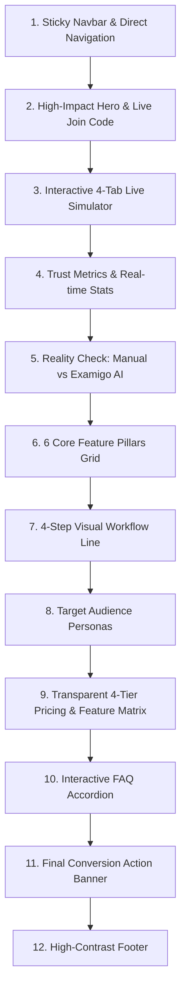

# 🌟 PRD: Examigo Next-Gen Landing Page (Spesifikasi Produk & Desain)

> **Dokumen Spesifikasi Kebutuhan Produk (PRD) — Landing Page Berbasis Konversi Tinggi & Edu-Aesthetic**  
> **Platform**: Examigo — AI-Powered Online Exam Builder (SaaS)  
> **Versi**: 2.5 (High Contrast, Rich Motion, Anti-AI-Slop)  
> **Target Audience**: Guru, Dosen, Sekolah/Kampus, Bimbingan Belajar, HRD & Trainer  

---

## 📌 1. Ringkasan Eksekutif & Value Proposition

### 1.1 Visi Produk
Examigo Landing Page dirancang untuk menjadi etalase utama SaaS yang **modern, berenergi tinggi (eye-catching), interaktif, dan bebas dari klise ("AI Slop")**. Pengunjung dalam 5 detik pertama harus langsung memahami nilai nyata Examigo: *memangkas waktu pembuatan soal dari 3 jam menjadi 2 menit melalui AI ekstraksi materi, dilengkapi ruang ujian anti-curang dan penilaian otomatis real-time*.

### 1.2 Pilar Nilai Utama (Core Value Proposition)
1. **Ekstraksi Materi Cerdas (Bukan Chatbot Biasa)**: Unggah modul format PDF, Word, PPTX, atau foto lembar soal fisik, AI langsung menghasilkan butir soal berbobot (PG, Essay, Isian Singkat) lengkap dengan kunci jawaban dan pembahasan.
2. **Platform 100% Web Tanpa Install**: Murid & guru dapat langsung menyelenggarakan ujian dari browser smartphone (HP), tablet, maupun laptop dengan latensi rendah.
3. **Integritas Ujian Terjaga**: Mode *Fullscreen Lock*, deteksi perpindahan tab/aplikasi, acak butir soal & opsi A/B/C/D otomatis, serta penyimpanan jawaban *Auto Save* real-time.
4. **Grading & Laporan Instan**: Penilaian otomatis untuk PG dan bantuan skoring AI untuk Essay, disertai visualisasi analitik dan ekspor satu klik ke Excel (.xlsx), CSV, dan PDF.

---

## 🎨 2. Design System, Color Tokens & Motion Guidelines

Prinsip desain Examigo: **Eksplorasi Edukasi Premium, Kontras Tinggi, dan Gerakan Ringan (Lightweight Micro-Animations)**. Menolak warna ungu/violet/indigo dan menghindari elemen visual artifisial yang tidak bermakna.

### 2.1 Color Palette & Token Standar
| Token Name | Hex Code | Peran & Penggunaan |
| :--- | :--- | :--- |
| `edu-navy` | `#1B263B` | **Primary Brand Canvas & Typography** (Hero background, heading utama, elemen kontras tinggi). |
| `edu-electric` | `#0091D4` | **Interactive Accent & Action** (Tombol utama, highlight teks, indikator aktif). |
| `edu-butter` | `#FDD406` | **High-Attention Eye Catcher** (Badge promosi, highlight rating bintang, CTA "Daftar Gratis"). |
| `edu-sage` | `#87A96B` | **Security & Success Indicator** (Badge anti-cheat, status tersimpan otomatis, verifikasi). |
| `edu-ice` | `#F8FAFC` | **Background Canvas Section** (Slate-50, lembut di mata & kontras tajam dengan teks). |
| `edu-white` | `#FFFFFF` | **Surface Cards** (Kartu fitur dengan border 1px dan elevasi bayangan halus). |

> **⚠️ PANTANGAN DESAIN & KONTROL KONTRAST:**
> - **DILARANG** menggunakan warna ungu (*purple/violet/indigo*) di semua elemen UI.
> - **DILARANG** menempatkan teks putih di atas latar belakang putih atau abu-abu terang. Semua teks pada latar terang wajib menggunakan `#1B263B` atau `#334155`.
> - Semua ikon wajib berupa **Lucide SVG Icons** dengan kontras warna solid (bukan emoji generik).

### 2.2 Sistem Animasi Ringan (Lightweight Motion System)
Animasi harus meningkatkan pemahaman pengguna tanpa membebani performa perangkat (60 FPS, CSS GPU-accelerated):
1. **Ambient Hero Mesh Glow**: Efek pendaran radial dinamis (`bg-[#0091D4]/25 blur-[120px]`) pada hero section yang memberikan kedalaman tanpa video latar yang berat.
2. **Pulsing Status Pill**: Badge hero dengan animasi ping halus untuk menunjukkan platform selalu aktif dan siap pakai.
3. **Smooth Interactive Simulator**: Transisi tab 4-tahap (AI Generator → Builder → Ruang Ujian → Analitik) dengan opsi auto-slide yang dapat di-pause kapan saja oleh pengguna.
4. **Elevated Card Lift**: Efek hover `transform: translateY(-6px)` dengan bayangan berlapis `shadow-edu-card` pada setiap kartu fitur dan alur kerja.
5. **Interactive Question Picker**: Di dalam simulasi ruang ujian, tombol nomor soal dapat diklik secara interaktif untuk melihat perubahan tampilan pertanyaan secara instan.

---

## 🏗️ 3. Arsitektur Informasi & Spesifikasi Komponen Halaman

Landing page terdiri dari 12 bagian terintegrasi:

---

### 3.1 Bagian 1: Sticky Navigation Bar
- **Komponen**: Logo Examigo (varian *light* dengan logo emblem bintang `✦`), tautan navigasi (Fitur, Simulasi, Alur Kerja, Paket Harga, FAQ), dan tombol aksi cepat.
- **Interaksi**:
  - Tautan "Paket Harga ⚡" dilengkapi badge latar kuning butter `#FDD406` berteks navy untuk menarik klik.
  - State Login: Tombol langsung mengarahkan ke Dashboard Workspace.
  - State Non-Login: Tombol "Masuk" (transparan elegan) dan tombol "Daftar Gratis" (kuning butter berbayangan tajam).

---

### 3.2 Bagian 2: High-Impact Hero Section
- **Latar Belakang**: Gradasi gelap *Deep Navy* (`#1B263B` ke `#0D131F`) dengan ambient mesh glow biru elektrik dan kuning emas.
- **Elemen Headline**:
  - Pill Badge: *"Platform AI Pembuat Ujian & Kuis Online Cerdas No. 1 di Indonesia"* dengan indikator live ping.
  - Title H1: *"Bikin Soal & Ujian Online 10x Lebih Cepat ✦"* dengan garis bawah bergelombang kuning butter.
  - Sub-headline: Penjelasan singkat alur unggah materi → AI racik soal → auto-grading.
- **Dual Conversion Engine**:
  - Tombol Utama: *"Coba AI Generator Gratis"* (Biru elektrik `#0091D4` dengan hover scale).
  - Quick Join Form: Input kode ujian siswa (`KODE UJIAN...`) dengan tombol *"Ikut Ujian"* berlatar kuning butter untuk langsung masuk ke ruang ujian tanpa registrasi.
- **Trust Badges**: 3 lencana kepercayaan (100% Web Tanpa Install, Anti-Cheat Fullscreen Lock, Auto-Grading & Ekspor Excel).

---

### 3.3 Bagian 3: Interactive 4-Tab Live Simulator
Simulator interaktif yang memberikan pengalaman nyata bagi calon pengguna sebelum mendaftar:
1. **Tab 1: AI Generator**:
   - Menampilkan contoh ekstraksi dari file `Modul_Fisika_Kelas_10.pdf`.
   - Menampilkan soal Fisika nyata dengan pilihan ganda A, B, C, D yang **bisa diklik**. Jika opsi benar diklik, muncul checklist hijau dan kotak penjelasan AI (kunci jawaban berlandaskan rumus `a = F / m`).
2. **Tab 2: Exam Builder**:
   - Menampilkan konfigurasi ujian: Durasi 60 Menit, KKM 75, status Acak Soal aktif, dan acak pilihan jawaban aktif.
3. **Tab 3: Ruang Ujian Siswa (Focus Mode)**:
   - Menampilkan indikator Fullscreen Lock, penghitung waktu mundur 45:12, status auto-save, dan grid 12 nomor soal yang interaktif.
4. **Tab 4: Analitik & Hasil**:
   - Menampilkan metrik 142 peserta, rata-rata skor 86.4, kelulusan 94.2%, serta diagram persentase distribusi nilai siswa.

---

### 3.4 Bagian 4: Metrics Ticker & Social Proof
4 indikator performa berukuran besar dengan tipografi bold:
- **10,000+** Soal AI Di-generate
- **99.8%** Akurasi Auto-Grading
- **< 2 Menit** Waktu Pembuatan Ujian Lengkap
- **100%** Mendukung Kurikulum Merdeka & Standar Penilaian Nasional

---

### 3.5 Bagian 5: Reality Check (Manual Tradisional vs Examigo AI)
Tabel perbandingan visual 2 kolom yang membandingkan friksi cara lama vs kecepatan Examigo:
- **Cara Manual (Merah/X)**: Mengetik soal berjam-jam, rawan contek karena nomor sama, koreksi kertas satu per satu hingga larut malam, arsip soal tercecer di file Word.
- **Solusi Examigo (Hijau Sage/Checklist)**: Ekstraksi AI 10 detik, acak nomor & opsi otomatis, auto-grading instan, dan Bank Soal terpusat siap ekspor Excel.

---

### 3.6 Bagian 6: 6 Core Feature Pillars Grid
Kartu fitur interaktif berlatar putih dengan ikon Lucide besar dan warna background ikon solid:
1. **AI Question Generator** (Ikon Bot • Navy/Butter): Dukungan PDF, DOCX, PPT, TXT, dan foto soal fisik.
2. **Bank Soal Terorganisir** (Ikon BookOpen • Biru Elektrik): Filter mapel, kelas, tingkat kesulitan, dan toolbar rumus matematika.
3. **Exam Builder Fleksibel** (Ikon Layers • Kuning Butter): Acak soal & opsi, token akses, QR Code, dan pengaturan durasi.
4. **Anti-Cheat Mode** (Ikon ShieldCheck • Hijau Sage): Fullscreen lock, deteksi pindah tab, dan real-time auto save.
5. **Auto-Grading & Analitik** (Ikon BarChart2 • Navy): Koreksi instan PG & esai AI, analisis daya pembeda soal.
6. **Ekspor Laporan Lengkap** (Ikon Download • Biru Elektrik): Unduh hasil dalam format Excel (.xlsx), CSV, dan cetak PDF.

---

### 3.7 Bagian 7: 4-Step Interactive Visual Workflow
Alur 4 tahap dengan garis hubung gradasi dinamis:
1. `Langkah 1`: **Upload Materi** (Unggah PDF, Word, PPT, foto soal).
2. `Langkah 2`: **AI Generate Soal** (AI meracik butir soal dan kunci jawaban).
3. `Langkah 3`: **Publikasi Ujian** (Bagikan kode akses atau QR code).
4. `Langkah 4`: **Auto-Grading** (Siswa selesai, nilai dan rekap analitik langsung tersaji).

---

### 3.8 Bagian 8: Target Audience Spotlight
4 segmen pengguna dengan kartu yang terdefinisi jelas:
- **Guru & Dosen**: Memudahkan ulangan harian, UTS, dan UAS tanpa lembur koreksi.
- **Sekolah & Kampus**: Standarisasi ujian online antar-kelas dengan laporan terpusat.
- **Bimbel & Kursus**: Fasilitas tryout online dan latihan soal adaptif.
- **HRD & Corporate Trainer**: Asesmen karyawan baru dan sertifikasi pelatihan internal.

---

### 3.9 Bagian 9: Transparent 4-Tier Pricing & Feature Comparison
Tabel harga transparan dengan integrasi Payment Gateway resmi **Pakasir (QRIS & Bank Transfer)**:
1. **Free (Rp 0)**: 5 Peserta, 1 Ujian aktif, Bank soal 15 butir, auto-grading dasar.
2. **Personal (Rp 49.000/bln)**: 100 AI Questions/bln, 50 Peserta, 5 Ujian aktif, upload dokumen, ekspor Excel/CSV.
3. **Pro AI ⭐ Terpopuler (Rp 149.000/bln)**: 300 AI Questions/bln, 200 Peserta, 15 Ujian, penilaian Esai AI, Full Anti-Cheat Lock, 3 akses guru.
4. **Enterprise (Custom Plan)**: Unlimited peserta & soal, dedicated cloud instance, Custom Domain & Single Sign-On (SSO).
- **Matriks Komparasi Rinci**: Tabel komparasi lengkap fitur per baris untuk mempermudah keputusan institusi.

---

### 3.10 Bagian 10: Interactive FAQ Accordion
Accordion tanya-jawab interaktif dengan transisi halus:
- Kebutuhan instalasi aplikasi (100% web browser, tidak butuh install).
- Format file yang didukung AI.
- Keamanan & pencegahan kecurangan.
- Kompatibilitas ekspor data ke Excel & PDF.

---

### 3.11 Bagian 11 & 12: High-Conversion CTA & Footer
- **Action Banner**: Kartu berlatar Deep Navy dengan pendaran cahaya, teks ajakan aksi, dan tombol *"Daftar Akun Gratis Sekarang ✦"*.
- **Footer**: Logo Examigo berlatar putih/slate dengan kontras tinggi, navigasi lengkap, dan *copyright* resmi.

---

## ⚡ 4. Target Performa & Kualitas Teknis

1. **Core Web Vitals**:
   - **Largest Contentful Paint (LCP)**: < 1.2 detik (Optimasi CSS & font *Plus Jakarta Sans*).
   - **Cumulative Layout Shift (CLS)**: 0.00 (Semua rasio container statis).
   - **First Input Delay / INP**: < 50ms (Interaksi tab dan FAQ ringan tanpa re-render berlebih).
2. **Aksesibilitas & Keterbacaan**:
   - Kontras warna WCAG AAA pada teks utama (`#1B263B` di atas `#FFFFFF` dan `#F8FAFC`).
   - Touch targets minimum 48px untuk navigasi mobile.
3. **Responsivitas**:
   - 100% Fluid dari ukuran layar 320px (smartphone kecil) hingga 4K display.

---

## 📅 5. Status Implementasi & Verifikasi
- **Frontend Page**: [LandingPage.tsx](file:///Users/rizkihidayat/Documents/PROJECT/Examigo/client/src/pages/LandingPage.tsx)
- **Komponen Logo**: [ExamigoLogo.tsx](file:///Users/rizkihidayat/Documents/PROJECT/Examigo/client/src/components/common/ExamigoLogo.tsx)
- **Payment Library**: [payment.ts](file:///Users/rizkihidayat/Documents/PROJECT/Examigo/client/src/lib/payment.ts)
- **Status**: Siap dirilis & terhubung penuh ke backend API.
